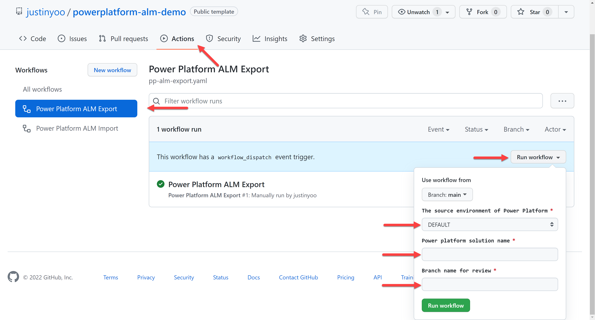
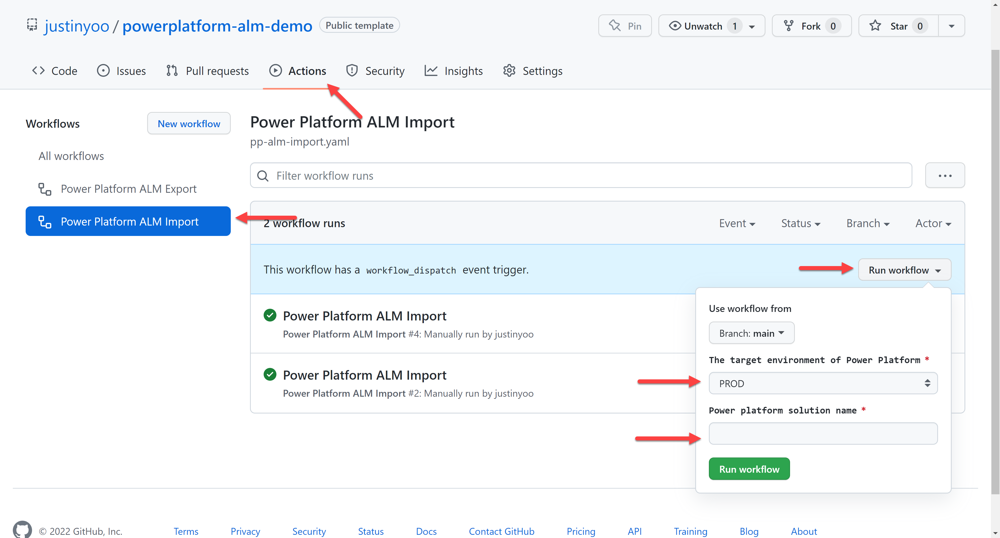

# Power Platform ALM Demo #

This is the demo repository for Power Platform ALM.

> NOTE: This is the template repository, meaning you can create your repo with this template. Alternatively, you can simply fork this repository.

## Prerequisites ##

You need to prepare the followings before starting this exercise.

### Power Platform Environment ###

You need to have at least one additional environment (PROD) on your tenant other than the DEFAULT environment. To create the extra environment, please refer to this document, [Create required environments](https://docs.microsoft.com/power-platform/alm/tutorials/github-actions-start?WT.mc_id=dotnet-66048-juyoo#create-required-environments).

> You can use either Production or Trial type for this exercise. Make sure that the Trial environment will expire in 30 days and be permanently deleted unless you convert it to Production.

### Service Principal ###

You need to create a service principal to run the Power Platform CLI within GitHub Actions workflow. To create the service principal, please refer to this document, [Create the service principal account and give it rights to the environments created](https://docs.microsoft.com/power-platform/alm/tutorials/github-actions-start?WT.mc_id=dotnet-66048-juyoo#create-the-service-principal-account-and-give-it-rights-to-the-environments-created).

### GitHub Secrets ###

The following GitHub Secrets are necessary to run the GitHub Actions workflow.

* `PP_DEFAULT_URL`: The Dataverse URL associated with the DEFAULT environment. It may look like `https://org*****.crm**.dynamics.com`.
* `PP_PROD_URL`: The Dataverse URL associated with the PROD environment. It may look like `https://org*****.crm**.dynamics.com`.
* `SPN_CLIENT_ID`: The client ID of Service Principal generated from Azure Active Directory.
* `SPN_CLIENT_SECRET`: The client secret of Service Principal generated from Azure Active Directory.
* `SPN_TENANT_ID`: The tenant ID of Azure Active Directory.
* `GH_TOKEN`: The GitHub Personal Access Token, just in case GitHub Action's `GITHUB_TOKEN` doesn't work, use this PAT.

## Getting Started ##

* `Power Platform Export`:
  * To export a solution and include it to this repository, run this GitHub Actions workflow at the Actions tab:

    

  * Once the workflow runs successfully, create PR for further review and merge.

* `Power Platform Import`:
  * To import a solution from this repository, run this GitHub Actions workflow at the Actions tab:

    

  * Once the workflow runs successfully, go to your Power Apps portal and check the destination environment whether the solution has been imported successfully or not.